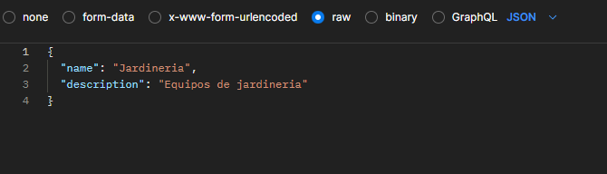

# ContenerizacionProject
Proyecto Contenerizacion y Orquestacion

## Prerequisitos
- Gradle
- Java 21
- docker

## Instrucciones
- Ejecutar el comando docker stack deploy -c stack-deploy.yml appmicroservices, esto desplegara los contenedores
- Realizar pruebas con Postman (el sistema no tiene una interfaz grafica unicamente EndPoints)
- Para obtener un token se debe realizar un POST a http://localhost:8082/auth/login el cual retornara un token, este token nos servira para el resto de servicios.
- Para crear una categoria se debe ejecutar un POST http://localhost:8083/categories y se debe mandar el token como Bearer token, el body del request debe tener el siguiente formato:
  
- Para crear un producto se debe ejecutar un POST http://localhost:8083/products/category/{CategoryId} y se debe mandar el token como Bearer token, el body del request debe tener el siguiente formato:
  
- Para crear un client se debe ejecutar un POST http://localhost:8084/clients y se debe mandar el token como Bearer token, el body del request debe tener el siguiente formato:
  
- Para crear una venta se debe ejecutar un POST http://localhost:8085/sales y se debe mandar el token como Bearer token, el body del request debe tener el siguiente formato:
  
- El servicio Logs, unicamente esta registrando cuando se crean productos nuevos.